# 📊 Diagramas - Brain Agriculture

Visualizações da arquitetura e processos do projeto usando **Mermaid**.

## 👀 Como Visualizar os Diagramas

Os diagramas deste documento são escritos em **Mermaid**, uma linguagem de diagramas baseada em texto.

### Opção 1: GitHub (Recomendado)

O GitHub renderiza diagramas Mermaid automaticamente. Basta visualizar este arquivo no GitHub.

### Opção 2: VS Code

Instale a extensão **Markdown Preview Mermaid Support**:

1. Abra o VS Code
2. Vá em Extensions (Ctrl+Shift+X)
3. Busque por "Markdown Preview Mermaid Support"
4. Instale e recarregue
5. Abra este arquivo e use Preview (Ctrl+Shift+V)

### Opção 3: Online

Copie o código Mermaid e cole em:

- https://mermaid.live/ (Editor oficial)
- https://mermaid.ink/ (Gerador de imagens)

### Opção 4: Outras IDEs

- **IntelliJ/WebStorm**: Plugin "Mermaid"
- **Obsidian**: Suporte nativo
- **Notion**: Suporte nativo

---

## 🏗️ Arquitetura FSD

### Camadas e Fluxo de Dependências

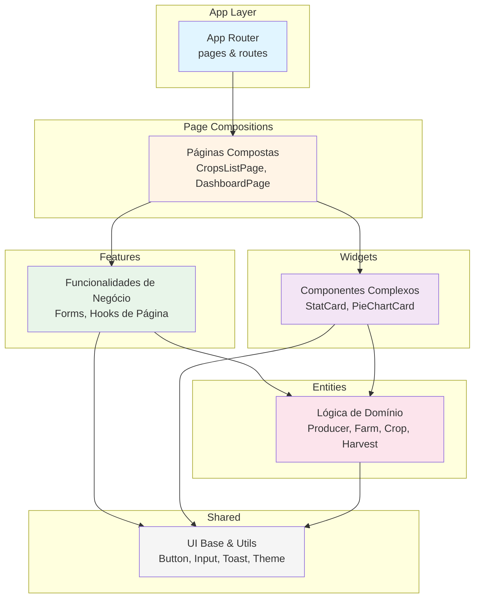

**Regra principal:** Camadas superiores podem importar das inferiores, mas **nunca o contrário**.

---

## 🗄️ Diagrama de Banco de Dados

### Modelo Entidade-Relacionamento

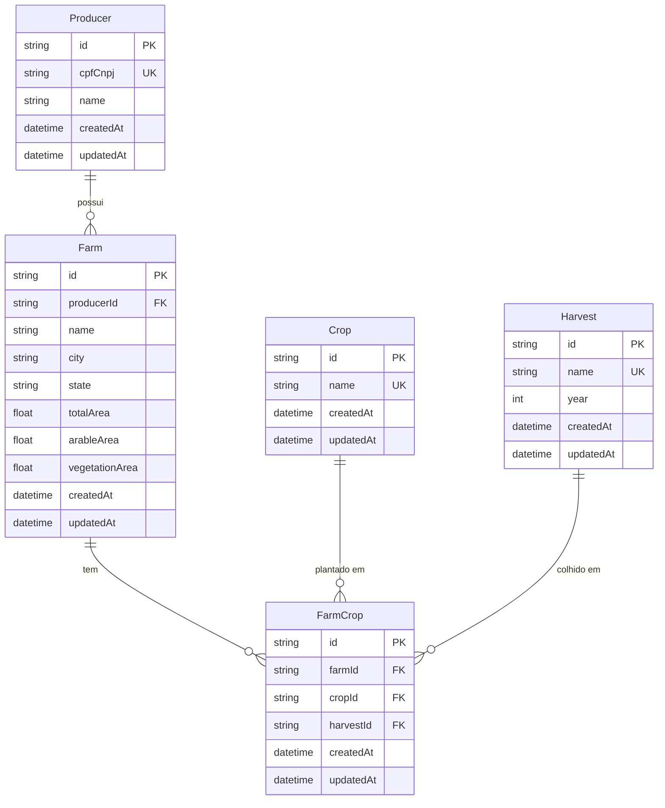

**Relacionamentos:**

- Um **Produtor** pode ter várias **Fazendas**
- Uma **Fazenda** pode plantar várias **Culturas** em diferentes **Safras**
- A tabela **FarmCrop** faz o relacionamento N:N:N

**Validações:**

- `arableArea + vegetationArea ≤ totalArea` (Fazenda)
- `cpfCnpj` deve ser único (Produtor)
- `name` deve ser único (Crop e Harvest)
- Constraint único: `[farmId, harvestId, cropId]` (FarmCrop)

---

## 🔄 Fluxo de Dados na Aplicação

### Arquitetura de Fluxo (Frontend → Backend)

```mermaid
graph LR
    subgraph "Frontend"
        UI[Componente UI<br/>ProducerForm]
        HOOK[Hook de Página<br/>useProducersListPage]
        ENTITY[Entity Hook<br/>useCreateProducer]
        API[API Client<br/>createProducer]
    end

    subgraph "Backend"
        ROUTE[API Route<br/>/api/producers]
        VALID[Validação<br/>Zod Schema]
        PRISMA[Prisma ORM]
        DB[(PostgreSQL)]
    end

    UI -->|submit| HOOK
    HOOK -->|mutate| ENTITY
    ENTITY -->|fetch| API
    API -->|POST| ROUTE
    ROUTE -->|validate| VALID
    VALID -->|query| PRISMA
    PRISMA -->|SQL| DB

    DB -->|result| PRISMA
    PRISMA -->|data| VALID
    VALID -->|response| ROUTE
    ROUTE -->|JSON| API
    API -->|update cache| ENTITY
    ENTITY -->|onSuccess| HOOK
    HOOK -->|showToast| UI

    style UI fill:#e3f2fd
    style HOOK fill:#f3e5f5
    style ENTITY fill:#e8f5e9
    style API fill:#fff3e0
    style ROUTE fill:#fce4ec
    style DB fill:#ffebee
```

---

## 📝 Fluxo de CRUD

### Ciclo Completo: Criar, Atualizar e Deletar

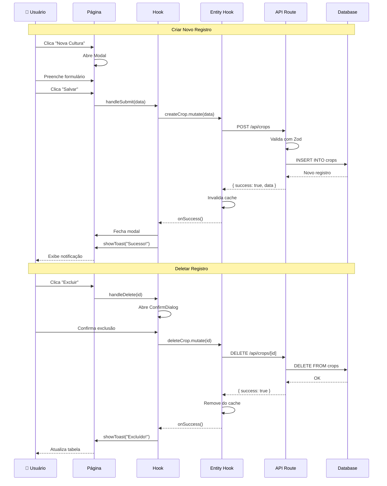

---

## 📊 Dashboard - Agregação de Dados

### Fluxo de Estatísticas

```mermaid
graph TB
    subgraph "Frontend"
        DASH[DashboardPage]
        HOOK[useDashboardStats]
        WIDGETS[Widgets]
        STAT[StatCard]
        PIE[PieChartCard]
    end

    subgraph "Backend"
        API[/api/dashboard/stats]
        AGG[Agregações]
    end

    subgraph "Database"
        PROD[(Producers)]
        FARM[(Farms)]
        CROP[(Crops)]
        HARV[(Harvests)]
        FC[(FarmCrops)]
    end

    DASH -->|usa| HOOK
    HOOK -->|fetch| API

    API -->|consulta| FARM
    API -->|consulta| FC

    API -->|agrega| AGG
    AGG -->|totalFarms| API
    AGG -->|totalHectares| API
    AGG -->|farmsByState| API
    AGG -->|farmsByCrop| API
    AGG -->|landUse| API

    API -->|retorna stats| HOOK

    HOOK -->|data| WIDGETS
    WIDGETS -->|totalFarms| STAT
    WIDGETS -->|farmsByState| PIE
    WIDGETS -->|farmsByCrop| PIE

    style DASH fill:#e3f2fd
    style API fill:#fff3e0
    style AGG fill:#f3e5f5
    style PROD fill:#ffebee
    style FARM fill:#ffebee
    style CROP fill:#ffebee
```

---

## 🎯 Entity - Estrutura Interna

### Organização de uma Entity (Exemplo: Producer)

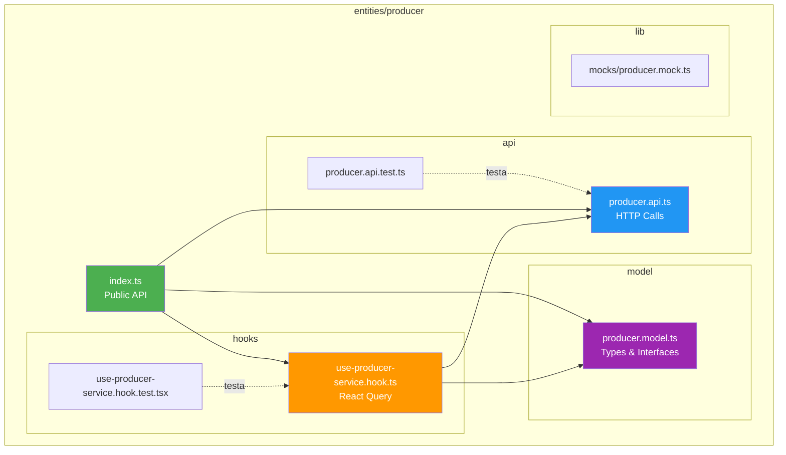

---

## ⚡ Feature - Estrutura Interna

### Organização de uma Feature (Exemplo: Crops)

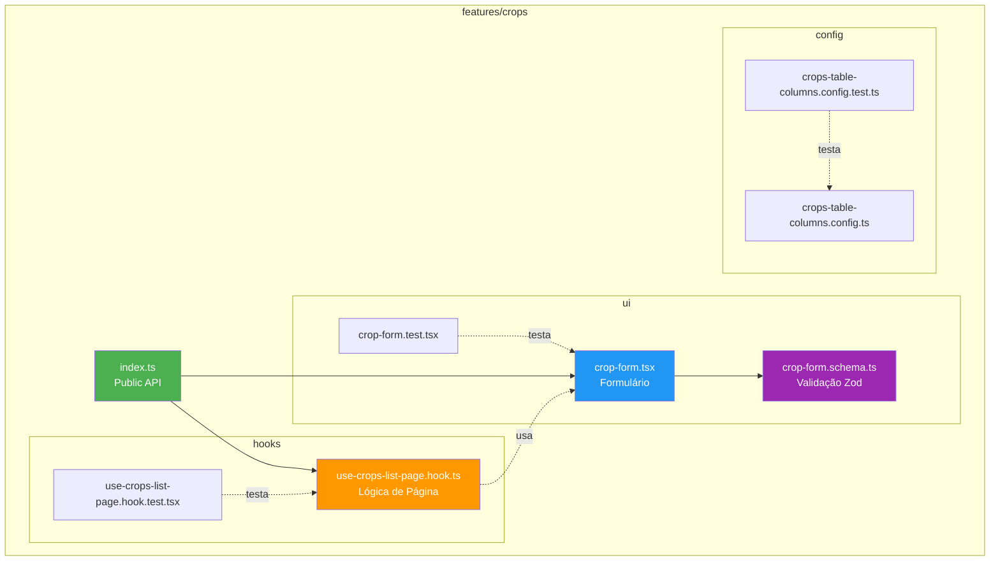

---

## 🔄 React Query - Cache e Sincronização

### Gerenciamento de Estado com React Query

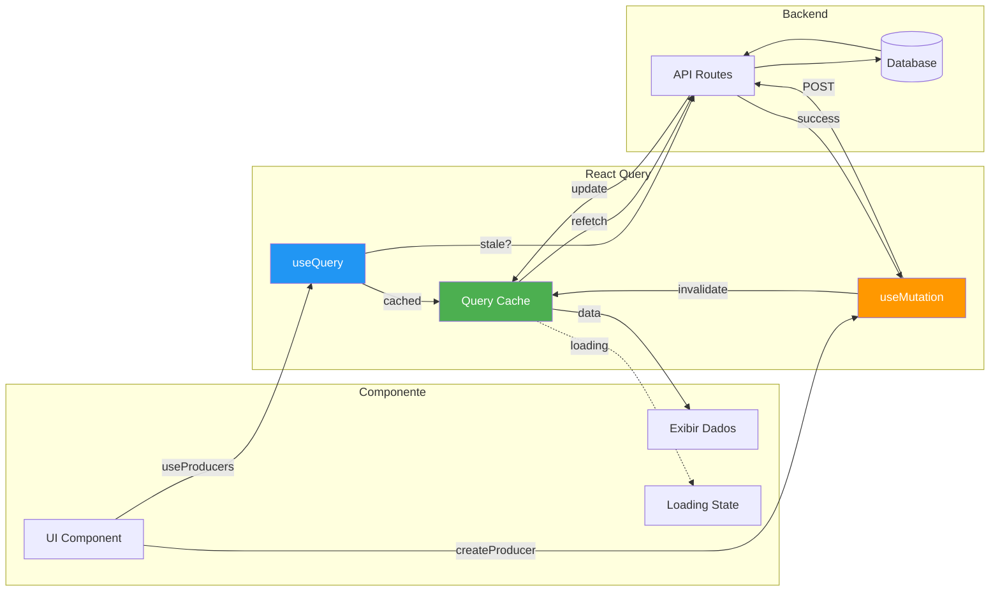

**Benefícios:**

- ✅ Cache automático
- ✅ Sincronização em tempo real
- ✅ Loading states gerenciados
- ✅ Retry automático em erros
- ✅ Invalidação otimista

---

## 🎨 Sistema de Notificações

### Toast e ConfirmDialog

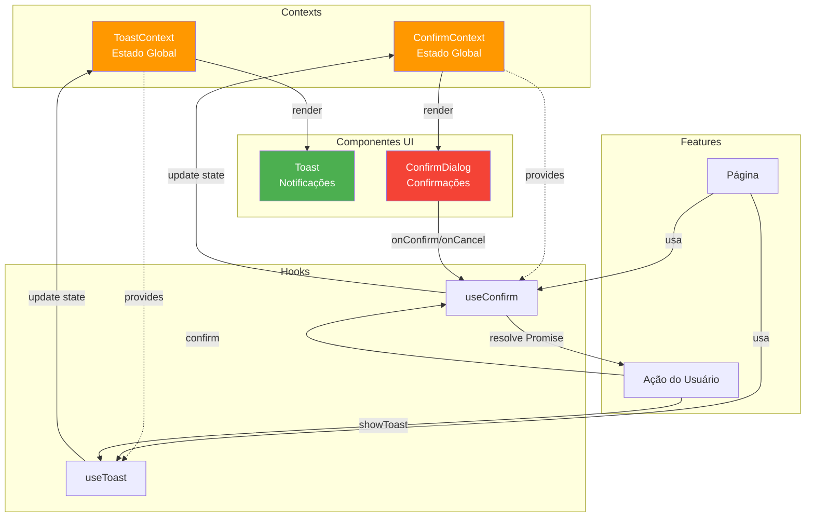

**Fluxo de Confirmação:**

1. Usuário clica em "Excluir"
2. `handleDelete` chama `confirm()` (async)
3. `ConfirmDialog` aparece na tela
4. Usuário confirma ou cancela
5. Promise resolve com `true` ou `false`
6. Ação prossegue baseado na resposta

---

## 📦 Estrutura de Pastas Detalhada

### Organização Completa do Projeto

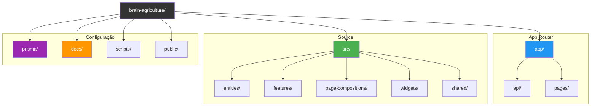

---

## 🚀 Fluxo Completo: Do Usuário ao Banco

### Exemplo: Criar Novo Produtor

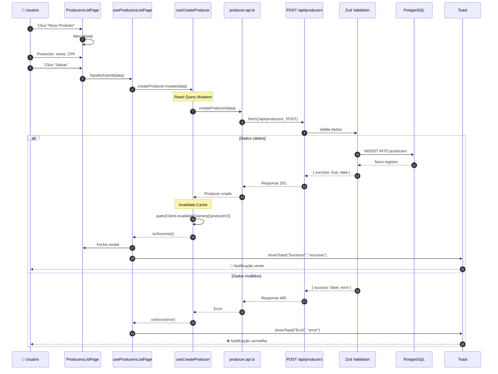

---

## 🗑️ Fluxo de Exclusão com Confirmação

### Exemplo: Deletar Produtor

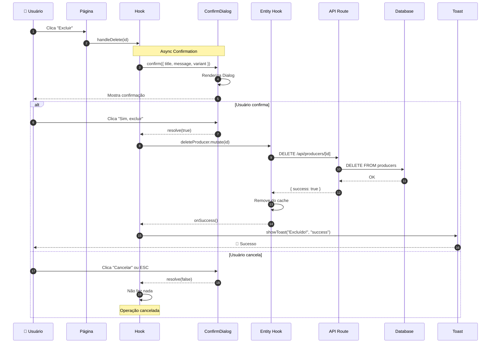

---

## 🧪 Estrutura de Testes

### Pirâmide de Testes do Projeto

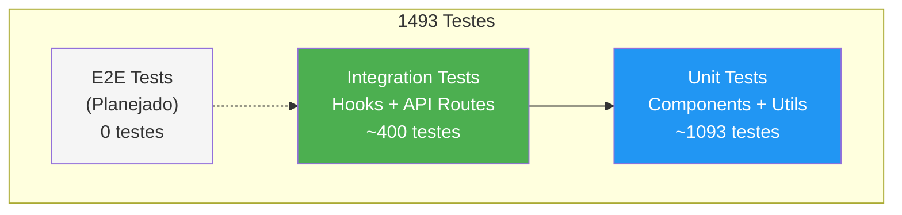

**Cobertura por camada:**

- ✅ **Shared**: 100% (Components, Utils, Contexts)
- ✅ **Entities**: 100% (API, Hooks, Models)
- ✅ **Features**: 100% (Hooks, Forms, Configs)
- ✅ **Page Compositions**: 100% (Páginas)
- ✅ **Widgets**: 100% (StatCard, PieChartCard)
- ✅ **API Routes**: 100% (Todos os endpoints)

---

## 🔐 Validação em Cascata

### Frontend e Backend

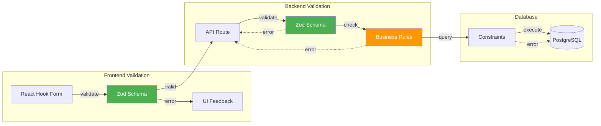

**Dupla validação:**

1. **Frontend** - Feedback imediato (UX)
2. **Backend** - Segurança e consistência

---

## 📚 Recursos

- **Documentação FSD**: https://feature-sliced.design/
- **React Query**: https://tanstack.com/query/latest
- **Zod**: https://zod.dev/
- **Prisma**: https://www.prisma.io/docs

---

**[← Voltar para Documentação](./README.md)**
